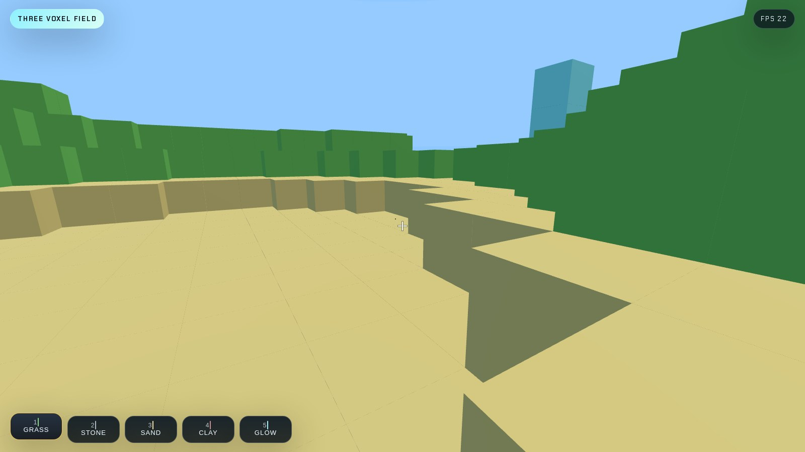

# Three Voxel Game



Three.js で構築した、ブラウザですぐ遊べるボクセルゲーム風 Web アプリです。起伏のある地形を歩き回りながら、ブロックを壊したり、5種類のブロックを置いたりできます。GitHub Pages 向けのサブパス配信を前提に調整してあり、`main` への push で自動デプロイされます。

## App Overview

- Uneven voxel terrain generated at startup
- First-person controls with `WASD`, `Space`, and pointer-lock mouse look
- Left click to break blocks, right click to place blocks
- `1` to `5` hotbar switching with distinct block colors
- HUD with crosshair, hotbar, control card, and live FPS badge
- Responsive overlay that keeps canvas and HUD aligned after resize

## Controls

| Input | Action |
| --- | --- |
| Click on the scene | Capture pointer |
| `W` `A` `S` `D` | Move |
| `Space` | Jump |
| Mouse move | Look around |
| Left click | Break targeted block |
| Right click | Place selected block |
| `1` `2` `3` `4` `5` | Switch block type |

## Local Development

```bash
npm install
npm run dev -- --host 127.0.0.1
```

Production build:

```bash
npm run build
```

## GitHub Pages

Public URL:

`https://kitayoshihiro.github.io/three-voxel-game/`

The app uses a Vite base path that switches automatically when GitHub Actions builds the project for Pages, so asset URLs remain correct under the repository subpath.

## CI/CD

The repository includes `.github/workflows/deploy.yml`. Every push to `main` runs:

1. `npm ci`
2. `npm run build`
3. `actions/upload-pages-artifact`
4. `actions/deploy-pages`

That workflow publishes the `dist/` output directly to GitHub Pages without any manual deployment step.

## QA Notes

- Local functional QA was executed with Playwright against the Vite dev server.
- Local visual QA screenshots are stored under `artifacts/local/`.
- The same Playwright runner can be reused against the published Pages URL after deployment.
